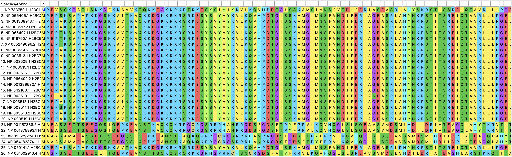
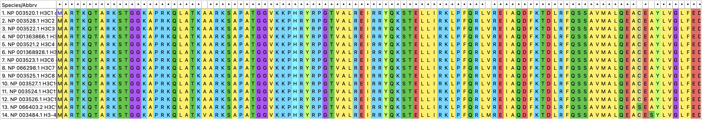
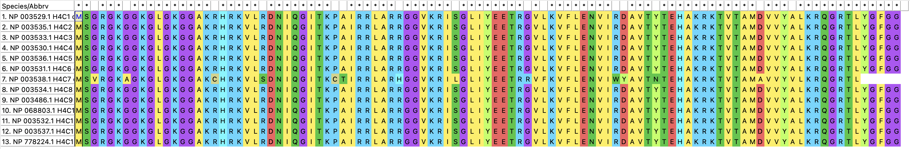
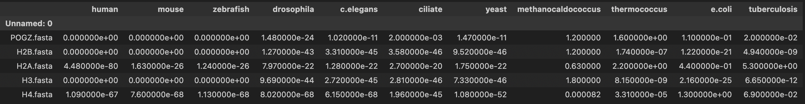
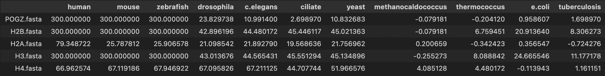
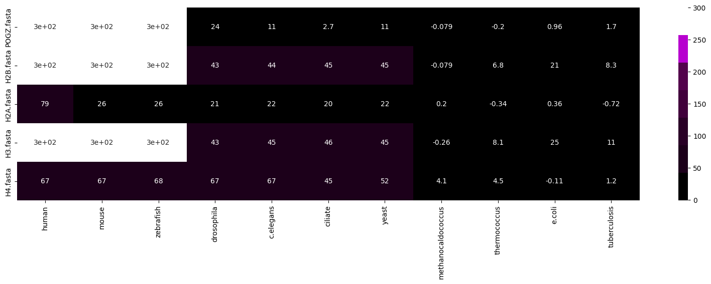
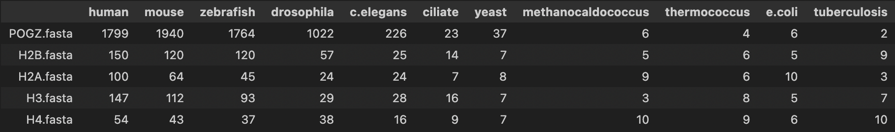

# HSE23 Minor Project

## Общая информация
**Ген:** POGZ
 **Эпигенетическая группа:** H3K9me
 **Эпигенетическая функция:** Histone modification read

**Статья:** 
 [Reader interactome of epigenetic histone marks in birds](https://pubmed.ncbi.nlm.nih.gov/26703087/) 
 POGZ является потенциальным считывателем H3K9me3, поскольку он содержит палец PHD, который специфически связывается с этой гистоновой меткой. Иммунопреципитация хроматина с последующим секвенированием (ChIP-seq) используется для идентификации белков, которые взаимодействуют с различными гистоновыми метками в клетках птиц, и было обнаружено, что POGZ обогащен в геномных локусах, отмеченных H3K9me3.

## Выравнивание гистонов
|Название | Скрин |
|:-:|:-:|
|H2A||
|H2B||
|H3||
|H4||
## E-value

## -log10

## Heatmap

## Hit Number

## Вывод 