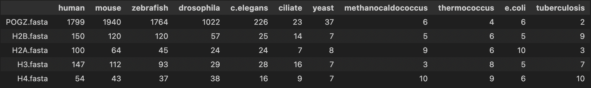

# HSE23 Minor Project

## Общая информация
**Ген:** POGZ
 **Эпигенетическая группа:** H3K9me
 **Эпигенетическая функция:** Histone modification read

**Статьи:** 
 [Reader interactome of epigenetic histone marks in birds](https://pubmed.ncbi.nlm.nih.gov/26703087/) 
 POGZ является потенциальным считывателем H3K9me3, поскольку он содержит палец PHD, который специфически связывается с этой гистоновой меткой. Иммунопреципитация хроматина с последующим секвенированием (ChIP-seq) используется для идентификации белков, которые взаимодействуют с различными гистоновыми метками в клетках птиц, и было обнаружено, что POGZ обогащен в геномных локусах, отмеченных H3K9me3.
 [Autism risk gene POGZ promotes chromatin accessibility and expression of clustered synaptic genes](https://www.ncbi.nlm.nih.gov/pmc/articles/PMC9512081/) 
 Вредоносные генетические варианты в POGZ, который кодирует регулятор хроматина Pogo Mobile Element с белком домена ZNF, тесно связаны с расстройствами аутистического спектра (ASD). В стате раскрывается геномное связывание POGZ в развивающемся переднем мозге в эухроматиновых локусах и регуляторных элементах генов (RE). Также профилируется доступность хроматина и экспрессия генов у мышей Pogz-/- и доказывается, что POGZ способствует активному состоянию хроматина и транскрипции сгруппированных синаптических генов.

## Выравнивание гистонов
### H2A

Между последовательностями есть различия, но они похожи между собой по пространственному строению. Поэтому они выполняют одинаковые функции, но последовательности различаются, скорее всего, это связано с мутациями и полиморфизмом.
### H2B

Между последовательностями есть различия, но они похожи между собой по пространственному строению. Поэтому они выполняют одинаковые функции, но последовательности различаются, скорее всего, это связано с мутациями и полиморфизмом.
### H3

Между последовательностями практически нет различий, значит гены являются копиями.
### H4

Между последовательностями практически нет различий, однако их чуть больше чем в предыдущем случае, но тут также гены являются копиями.

## Таблицы с результатами и тепловая карта, вывод
### Evalue

### -log10(Evalue)

### Heatmap

### Hits Number

### Вывод 
Выбранный белок гена POGZ эволюционно появился у дрожжей (yeast). Также подтверждается связь с H3 семейством гистонов.